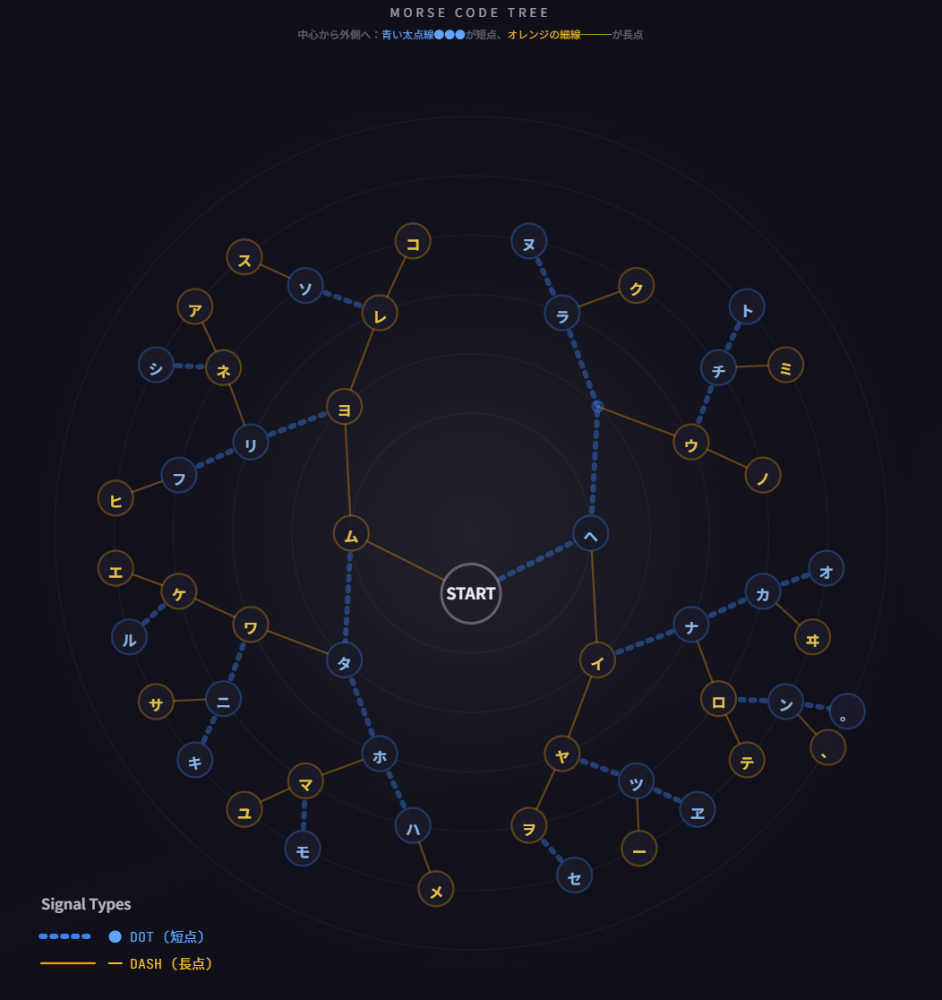

# Morse Signal App 🔊✨

モールス信号の変換・再生・可視化を行うReactアプリケーションです。


## デモ

🌐 **[Live Demo](https://m-masaki72.github.io/morse-signal-app/)**



## 特徴

### 🌐 日本語・英語対応
- **和文モールス**: カタカナ（イロハニホヘト順）に対応
- **欧文モールス**: A-Z、0-9に対応
- ひらがな入力も自動でカタカナに変換
- 濁音・半濁音も自動分解（ガ → カ + ゛）

### 🎵 音と光の再生
- Web Audio APIによるビープ音再生
- 短点（DOT）と長点（DASH）で光の色が変化
  - 短点: 青い光
  - 長点: オレンジの光
- 再生速度の調整が可能

### 🌳 放射状樹形図（サンバースト）可視化
- モールス信号の二分木構造を放射状に表示
- 線のスタイルで信号を区別:
  - **短点（DOT）**: 青い太い点線 ●●●
  - **長点（DASH）**: オレンジの細い実線 ───
- 再生中はパスがアニメーションでハイライト

## セットアップ（ローカル開発）

```bash
# 依存関係のインストール
npm install

# 開発サーバーの起動
npm run dev

# プロダクションビルド
npm run build

# ビルドのプレビュー
npm run preview
```

## GitHub Pagesへのデプロイ

このプロジェクトはGitHub Actionsを使って自動デプロイされます。

### 初回セットアップ

1. GitHubにリポジトリ `morse-signal-app` を作成

2. コードをプッシュ:
   ```bash
   git init
   git add .
   git commit -m "Initial commit"
   git branch -M main
   git remote add origin https://github.com/m-masaki72/morse-signal-app.git
   git push -u origin main
   ```

3. GitHub Pages を有効化:
   - リポジトリの **Settings** → **Pages** に移動
   - **Source** で「**GitHub Actions**」を選択

4. 自動デプロイ:
   - `main` ブランチにプッシュすると自動でビルド＆デプロイされます
   - **Actions** タブでデプロイ状況を確認できます

5. 公開URL:
   ```
   https://m-masaki72.github.io/morse-signal-app/
   ```

## 技術スタック

- **React 18** - UIフレームワーク
- **Vite** - ビルドツール
- **Web Audio API** - 音声再生
- **SVG** - 放射状樹形図の描画
- **GitHub Actions** - CI/CD

## 和文モールスについて

和文モールス信号は「イロハニホヘト...」の順で定義されています：

| 文字 | 符号 | 文字 | 符号 |
|------|------|------|------|
| イ | ・－ | ロ | ・－・－ |
| ハ | －・・・ | ニ | －・－・ |
| ホ | －・・ | ヘ | ・ |
| ... | ... | ... | ... |

濁音は「清音 + 濁点（・・）」、半濁音は「清音 + 半濁点（・・－－・）」で表現されます。

## ライセンス

MIT License

## 作者

Created with Claude AI
